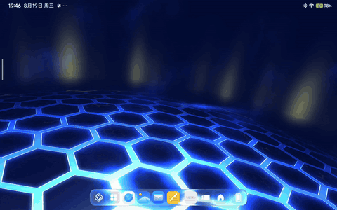

# LiquidDock


LiquidDock 是一个面向 HyperOS 3 Pad Launcher 的 LSPosed / libxposed API 101 模块，用于扩展系统 Dock 的液态玻璃、Dock 外观、桌面网格与工作台布局。

## 主要功能

- **Zero-copy Liquid Glass**：针对 HyperOS 3.0.307+ HotSeats material background，使用 PassBlur + GLES + Prismal 完成折射、色散、穹顶、Fresnel、镜面、焦散、振动度与 tint 等光学效果。
- **主题背景兼容**：同时识别 `HotSeatsListContentMiuiXBlurBackground` 与主题切换后的 `HotSeatsListContentBlurBackground2`，在背景实例或几何发生变化时重新绑定 glass。
- **Dock 几何**：宽度、高度、底部偏移、图标间距、圆角与相关 resize 行为可配置；307 glass 路径直接复用 vendor Dock 几何作为权威边界。
- **Dock 描边**：`DockStrokeRenderer` 同时服务 native blur Dock 与 307 glass，使用 outer / inner path 裁剪绘制，不把 Dock 中心填充成边框。
- **原生 Dock 自定义**：在未启用 zero-copy glass 的 native 路径中继续支持 blur radius、独立 Dock shadow、系统原生 shadow 抑制与 squircle 相关外观控制。
- **桌面网格**：可选横屏 8×4、竖屏 4×8，自定义横竖屏边距/间距、页面指示器位置，并包含 widget span / frame 适配和旋转后布局修复。
- **自由放置兼容**：自定义网格开启时，仅绕过 MIUI 针对 stock grid 的 swap-placement pattern rule；实际边界、占用矩阵与 vacancy 搜索仍由 Launcher 自己负责。
- **工作台 / Laptop 模式**：独立处理工作台 Dock 宽度、Dock 图标上下偏移、桌面与 All Apps 布局参数，并在模式切换时维护普通桌面布局。
- **Dock 分隔线**：可调宽度、高度比例、垂直偏移、颜色与透明度。
- **配置管理**：Schema 驱动的 Remote Preferences、JSON 导入/导出、默认预设和历史配置迁移。

当前实际 Hook 点与运行时边界见 [HOOKS.md](HOOKS.md)。

> `main` 现在是 2.x 主线。1.x 时代使用屏幕捕获的主线已归档到 `archive/1.x`。
> 
## 注入边界

```text
com.miui.home 系统桌面
```

## 兼容性

Liquid Glass 主路径针对 **HyperOS 3.0.307+ Pad Launcher** 版本的 HotSeats material 与 SurfaceFlinger PassBlur 私有接口实现。

液态玻璃效果依赖 ROM 中存在对应 vendor class 和隐藏 SurfaceControl transaction API。ROM 更新后如果这些私有接口发生变化，glass 会按 fail-closed 策略停止激活。

非玻璃功能的可用性仍取决于对应 HyperOS Launcher 类和方法是否存在。

## 构建

使用：

- Android SDK / compileSdk 37；
- JDK 17；
- libxposed API 101；
- Gradle 自动解析 `io.github.libxposed:api` / `service` 依赖。

Release：

```bash
ANDROID_HOME=/path/to/Android ./gradlew assembleRelease --no-daemon
```

Debug / CI 基线：

```bash
./gradlew testDebugUnitTest --stacktrace
./gradlew assembleDebug --stacktrace
```

Debug 与 Release 都经过 Android Gradle Plugin optimization / shrinker 路径。APK 位于 `build/outputs/apk/` 下对应构建类型目录。

## 分支

- **`main`** — 当前 2.x 开发主线。
- **`archive/1.x`** — 2.0 切换前的旧 `main`；包含 1.x 的 SystemUI / capture 架构历史。

如果需要排查旧截图管线、HOME / APP / RECENTS capture ownership 或 SystemUI / WMShell bridge，请以 `archive/1.x` 为历史参考，不要把其 Hook 关系套用到当前 `main`。

## 免责声明

本项目为非官方社区项目，与小米公司无关。"HyperOS" 与 "MIUI" 为其所有者商标，此处仅用于兼容性描述。

本项目仅供学习与研究使用。使用者自行承担使用风险；本项目禁止商用。

## 感谢

- **Prismal** — Liquid Glass 光学模型与 Shader 参数设计参考。
- **LSPosed / libxposed** — Hook API 与模块运行框架。
- **HyperCeiler** — HyperOS 模块工程实践参考。
- **HyperLight** — 旧版本屏幕捕获设计参考。

## 开源许可

本项目基于 [GPL-3.0](LICENSE) 许可开源。
