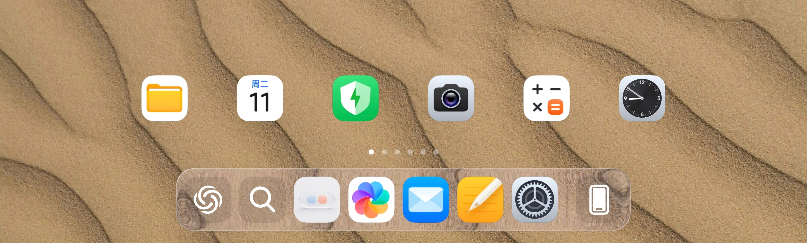

# LiquidDock

LiquidDock 是一个 LSPosed 模块，为 HyperOS 3 Pad 的启动器 Dock 带来液态玻璃效果。

## 特性

- **液态玻璃 Dock 背景**：Shader 内高斯模糊叠加深度折射、高光、描边与色散边缘（Prismal 光学模型）
- Dock 模糊强度、宽度、高度、底部偏移、独立模糊/描边圆角
- 圆角矩形与连续方圆形轮廓
- 可调描边厚度、基础 RGBA 颜色、Fill-Diff 渲染与描边开关
- 可调图标间距与匹配的 Dock 背景宽度
- 独立整体阴影：柔度、最大扩散、不透明度、Y 轴偏移
- HyperOS 原生 Dock 阴影抑制
- 匹配推荐布局与玻璃参数的默认预设
- 参数导入与导出（LSPosed Remote Preferences）
- 静态桌面零捕获（壁纸条带缓存复用）；app/多任务内实时屏幕捕获

开发结构与扩展规则见 [ARCHITECTURE.md](ARCHITECTURE.md)。

## 构建

要求：Android SDK - JDK 17 - LSPosed API 101（libs/api-101.jar）。

    ANDROID_HOME=/path/to/Android ./gradlew assembleRelease --no-daemon

Release 构建启用了 R8 代码与资源裁剪（`optimization.enable`），模块类与
Compose Miuix 类通过 `src/main/keepRules/liquiddock.keep` 保持不混淆；
产物生成于 build/outputs/apk/release/。

## 免责声明

本项目非官方社区项目，与小米公司无关。"HyperOS" 与 "MIUI" 为其所有者商标，此处仅用于兼容性描述。

本项目仅供学习与研究使用。使用者自行承担使用风险；本项目禁止商用。

## 感谢

感谢以下开源项目的作者，本项目在其基础上构建：

- **HyperCeiler** — 模块工程实践参考
- **Prismal** — 液态玻璃光学模型与 Shader 参数设计参考
- **LSPosed** — 模块 Hook API 与加载框架

降采样与屏幕捕获的设计思路受 HyperLight 启发。

## 开源许可

本项目基于 [GPL-3.0](LICENSE) 许可开源。
